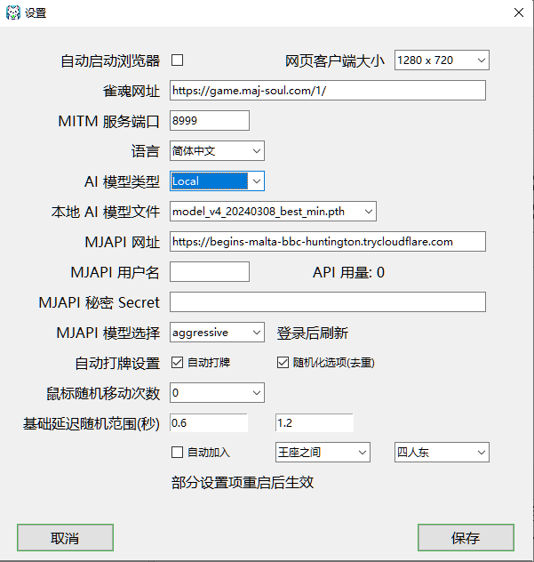

# 麻将 Copilot / Mahjong Copilot

麻将 AI 助手，基于 mjai (Mortal模型) 实现的机器人。会对游戏对局的每一步进行指导。现支持雀魂三人、四人麻将。
QQ群：834105526 <a target="_blank" href="https://qm.qq.com/cgi-bin/qm/qr?k=Mec5daqIyUsuZjCLojH_t88hQV6luPxl&jump_from=webapi&authKey=nNSpmIQY3ieVau/oLTF9eNO6YTqAm1+Ne3iE3zpqmFrj61iAUDu/GSpA38g93Zlx"></a>

Mahjong AI Assistant for Majsoul, based on mjai (Mortal model) bot impelementaion. When you are in a Majsoul game, AI will give you step-by-step guidance. Now supports Majsoul 3-person and 4-person game modes.

下载、帮助和更多信息请访问网站 Please see website for download, help, and more information  
<a href="https://mjcopilot.com/help" target="_blank">帮助信息</a> | <a href="https://mjcopilot.com" target="_blank">https://mjcopilot.com</a>

---


特性：

- 对局每一步 AI 指导，可在游戏中覆盖显示
- 自动打牌，自动加入游戏
- 多语言支持
- 支持本地 Mortal 模型和在线模型，支持三麻和四麻

Features:

- Step-by-step AI guidance for the game, with optional in-game overlay.
- Auto play & auto joining next game
- Multi-language support
- Supports Mortal local models and online models, 3p and 4p mahjong modes.

<a id="instructions"></a>

## 使用方法 / Instructions

### 开发

1. 克隆 repo
2. 安装 Python 虚拟环境。Python 版本推荐 3.11.
3. 安装 requirements.txt 中的依赖。
4. 主程序入口: main.py

示例脚本：

```batch
git clone https://github.com/latorc/MahjongCopilot.git
cd MahjongCopilot
python -m venv venv
CALL venv\Scripts\activate.bat
pip install -r requirements.txt
python main.py
```

### To Develope

1. Clone the repo
2. Install Python virtual environment. Python version 3.11 recommended.
3. Install dependencies from requirements.txt
4. Main entry: main.py

```batch
git clone https://github.com/latorc/MahjongCopilot.git
cd MahjongCopilot
python -m venv venv
CALL venv\Scripts\activate.bat
pip install -r requirements.txt
python main.py
```

## 截图 / Screenshots

界面 / GUI




游戏中覆盖显示 (HUD）/ In-game Overlay (HUD)


## 设计 / Design


## 鸣谢 / Credit

- 基于 Mortal 模型和 MJAI 协议
  Based on Mortal Model an MJAI protocol
  
  Mortal: https://github.com/Equim-chan/Mortal
- 设计和功能实现基于 Akagi
  Design and implementation based on Akagi
  
  Akagi: https://github.com/shinkuan/Akagi
- 参考 Reference
  Mahjong Soul API: https://github.com/MahjongRepository/mahjong_soul_api
- MJAI协议参考 / MJAI Protocol Reference
  
  MJAI: https://mjai.app

## 许可 / License
本项目使用 GNU GPL v3 许可协议。  
协议全文请见 [LICENSE](LICENSE)
