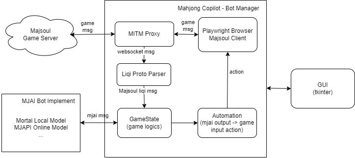

# 麻将 Copilot / Mahjong Copilot

麻将的 AI 助手，基于 mjai (Mortal模型)实现的机器人。会对游戏对局的每一步进行指导。现支持雀魂四人麻将。

特性：

- 对局每一步 AI 指导，可在游戏中覆盖显示
- 自动打牌，自动加入游戏
- 多语言支持
- 支持本地 Mortal 模型和在线模型

Mahjong AI Assistant for Majsoul, based on mjai (Mortal model) bot impelementaion. When you are in a Majsoul game, AI will give you step-by-step guidance. Now supports Majsoul 4-person mode games.

Features:

- Step-by-step AI guidance for the game, with optional in-game overlay.
- Auto play & auto joining next game
- Multi-language support
- Supports Mortal local models and online models

## 使用方法 / Instructions

### 运行方法

1. 从 Release 中下载压缩包并解压。 [Release](https://github.com/latorc/MahjongCopilot/releases)
2. 配置 AI 模型：
   1. 获取 Mortal 模型文件 （pth 文件），放到 'models' 目录中。模型文件请参见 [Akagi](https://github.com/shinkuan/Akagi?tab=readme-ov-file#installation). 或者
   2. 使用在线模型（MJAPI 支持自动注册）
3. 运行 exe 文件，点击雀魂按钮，在内置浏览器中启动雀魂客户端。

注意：使用自动打牌有风险，可能导致账户被封。请勿一天 24 小时使用自动打牌。

### To Run

1. Download and unzip the release from [Release](https://github.com/latorc/MahjongCopilot/releases)
2. Config AI model:
   1. Aquire Mortal model file (pth file), and put it into 'models' folder. For model file please refer to [Akagi](https://github.com/shinkuan/Akagi?tab=readme-ov-file#installation). Or,
   2. Use online models (MJAPI supports auto register new users)
3. Launch exe file. Click on the "Majsoul" button to launch game client in built-in Browser.

Note: Enable autoplay feature at your own risk because it may lead to account suspension. Do not use autoplay for like 24 hours a day.

### 开发

1. 克隆 repo
2. 安装 Python 虚拟环境。Python 版本推荐 3.11.
3. 安装 requirements.txt 中的依赖。
4. 主程序入口: main.py

示例脚本：

```batch
git clone https://github.com/latorc/MahjongCopilot.git
cd MahjongCopilot
python -m venv venv
CALL venv\Scripts\activate.bat
pip install -r requirements.txt
python main.py
```


### To Develope

1. Clone the repo
2. Install Python virtual environment. Python version 3.11 recommended.
3. Install dependencies from requirements.txt
4. Main entry: main.py


```batch
git clone https://github.com/latorc/MahjongCopilot.git
cd MahjongCopilot
python -m venv venv
CALL venv\Scripts\activate.bat
pip install -r requirements.txt
python main.py
```

## 截图 / Screenshots

界面 / GUI


游戏中覆盖显示 (HUD）/ In-game Overlay (HUD)


## 设计 / Design



## 鸣谢 / Credit

- 基于 Mortal 模型和 MJAI 协议
  Based on Mortal Model an MJAI protocol
  
  Mortal: https://github.com/Equim-chan/Mortal
- 设计和功能实现基于 Akagi
  Design and implementation based on Akagi
  
  Akagi: https://github.com/shinkuan/Akagi
- 参考 Reference
  Mahjong Soul API: https://github.com/MahjongRepository/mahjong_soul_api
- MJAI协议参考 / MJAI Protocol Reference
  
  MJAI: https://mjai.app

