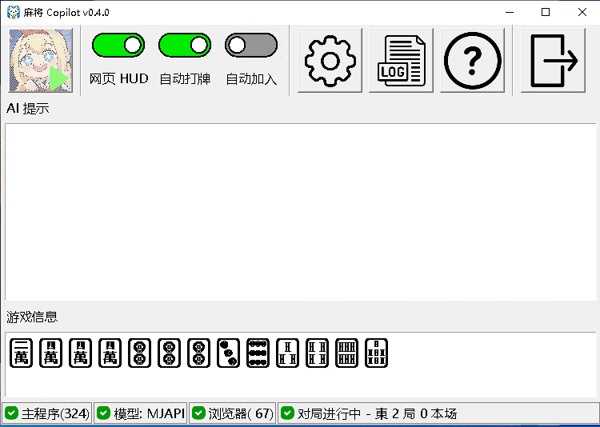

# 麻将 Copilot / Mahjong Copilot

麻将 AI 助手，基于 mjai (Mortal模型) 实现的机器人。会对游戏对局的每一步进行指导。现支持雀魂四人麻将。

Mahjong AI Assistant for Majsoul, based on mjai (Mortal model) bot impelementaion. When you are in a Majsoul game, AI will give you step-by-step guidance. Now supports Majsoul 4-person mode games.

[下载和使用说明 / Download&Instructions](#instructions)


特性：

- 对局每一步 AI 指导，可在游戏中覆盖显示
- 自动打牌，自动加入游戏
- 多语言支持
- 支持本地 Mortal 模型和在线模型

Features:

- Step-by-step AI guidance for the game, with optional in-game overlay.
- Auto play & auto joining next game
- Multi-language support
- Supports Mortal local models and online models


<a id="instructions"></a>

## 使用方法 / Instructions

### 运行方法


1. 从 Release 中下载压缩包并解压。 [Release](https://github.com/latorc/MahjongCopilot/releases)
2. 配置 AI 模型：
   1. 获取 Mortal 模型文件 （pth 文件），放到 'models' 目录中。模型文件请参见 [Akagi](https://github.com/shinkuan/Akagi?tab=readme-ov-file#installation). 或者
   2. 使用在线模型（MJAPI 支持自动注册）
3. 运行 exe 文件，点击雀魂按钮，在内置浏览器中启动雀魂客户端。

### To Run

1. Download and unzip the release from [Release](https://github.com/latorc/MahjongCopilot/releases)
2. Config AI model:
   1. Aquire Mortal model file (pth file), and put it into 'models' folder. For model file please refer to [Akagi](https://github.com/shinkuan/Akagi?tab=readme-ov-file#installation). Or,
   2. Use online models (MJAPI supports auto register new users)
3. Launch exe file. Click on the "Majsoul" button to launch game client in built-in Browser.

### 开发

1. 克隆 repo
2. 安装 Python 虚拟环境。Python 版本推荐 3.11.
3. 安装 requirements.txt 中的依赖。
4. 主程序入口: main.py

示例脚本：

```batch
git clone https://github.com/latorc/MahjongCopilot.git
cd MahjongCopilot
python -m venv venv
CALL venv\Scripts\activate.bat
pip install -r requirements.txt
python main.py
```

### To Develope

1. Clone the repo
2. Install Python virtual environment. Python version 3.11 recommended.
3. Install dependencies from requirements.txt
4. Main entry: main.py

```batch
git clone https://github.com/latorc/MahjongCopilot.git
cd MahjongCopilot
python -m venv venv
CALL venv\Scripts\activate.bat
pip install -r requirements.txt
python main.py
```

### 使用帮助：

1. 软件使用中间人 (MITM) 代理获取游戏客户端和服务器之间传输的信息。推荐使用内置的浏览器进行游戏。首次加载网页客户端，或游戏有更新时，会因为下载游戏素材而导致网页加载时间变长或疑似卡住。
2. 如果需要使用其他客户端，可以用代理软件 (如 Proxifier) 使客户端流量通过代理 ```http://localhost:{mitm端口}```  其他客户端暂不支持自动打牌。
3. 界面和设置项说明：
   
   1. 网页 HUD 开关: 在网页上覆盖显示信息和 AI 选项。关闭此项可略微提升自动打牌流畅度。
   2. AI 模型类型：
      
      - Local: 本地模型，需要准备 mortal.pth 文件放到 models 目录下。
      - MJAPI: (作者 9ns4esyx) 开发的在线麻将 AI API. 使用 MJAPI 时，可以填写已有的用户名和密钥。或者，将用户名和密钥 (Secret) 留空，软件会自动注册新用户并登录。MJAPI 有不同模型可选择，登陆后会刷新模型选项，并显示 API 用量。
   3. 自动打牌设置：
      
      - 自动打牌：自动化操作的总开关，关闭后将停止所有自动化操作。
      - 随机化选项：自动打牌时，根据模型推荐的前三选项，按概率（权重）随机选取其中之一。可以在分析牌谱时，降低模型重合率。
      - 鼠标随机移动次数：在鼠标点击前，随机移动几次，避免被检测为自动化操作。
      - 基础延迟随机范围：自动打牌前的延时。根据场况和打的牌，会在基础延迟上增加额外延迟（例如：东家第一巡会加几秒钟延迟，让理牌动画完成）。
      - 自动加入：自动加入下一局游戏，根据选择的级别和游戏模式。自动加入操作需要从主菜单或者游戏中开始。
4. 状态栏中，主程序和浏览器均会附加显示刷新率作为性能参考。通常数值在 100 以上说明程序运行流畅。进行自动打牌操作时，浏览器刷新率会下降。
5. 本程序使用 Pyinstaller 编译发布，暂时仅支持 Windows. 在帮助窗口中，可以进行自动更新。Mac 用户需要自助从 Python 源代码运行本程序。
6. 长时间使用自动打牌可能会导致账户被封禁。请合法使用本程序。使用者需要承担潜在风险和责任。

## 截图 / Screenshots

界面 / GUI




游戏中覆盖显示 (HUD）/ In-game Overlay (HUD)


## 设计 / Design


## 鸣谢 / Credit

- 基于 Mortal 模型和 MJAI 协议
  Based on Mortal Model an MJAI protocol
  
  Mortal: https://github.com/Equim-chan/Mortal
- 设计和功能实现基于 Akagi
  Design and implementation based on Akagi
  
  Akagi: https://github.com/shinkuan/Akagi
- 参考 Reference
  Mahjong Soul API: https://github.com/MahjongRepository/mahjong_soul_api
- MJAI协议参考 / MJAI Protocol Reference
  
  MJAI: https://mjai.app

